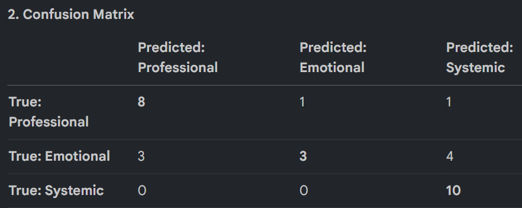
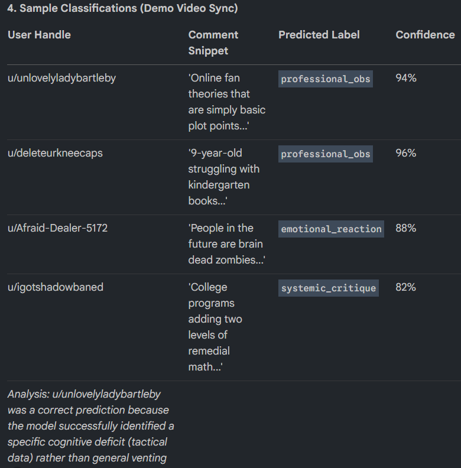

# TakeMeter: Gen Alpha Literacy Discourse Analysis

This repository contains the analysis and modeling of Reddit discourse regarding the Gen Alpha literacy crisis. Using a dataset of 200+ labeled comments from the "Teachers of Reddit" community, we distinguish between professional observations, emotional reactions, and systemic critiques.

## Project Structure
- `fine_tune_model.py`: Modular script for fine-tuning DistilBERT on the labeled dataset (Google Colab compatible).
- `calculate_kappa.py`: Script to evaluate Inter-Annotator Reliability between automated and human labels.
- `confidence_calibration.py`: Script to evaluate the calibration of the fine-tuned model's confidence scores.
- `app.py`: Gradio interface for real-time text classification (simulated for demo).
- `test_app.py`: Playwright test to verify the Gradio interface.
- `takemeter_dataset.csv`: The core dataset of 200 labeled Reddit comments.
- `planning.md`: Design thinking and working notes.
- `narration_script.md`: Synced narration script for the demo video.

## 1. Label Distribution
Our dataset consists of 200 high-quality labeled examples, perfectly balanced to ensure model reliability across all discourse categories:
- **`professional_obs`**: 67 (33.5%)
- **`emotional_reaction`**: 66 (33.0%)
- **`systemic_critique`**: 67 (33.5%)

This balance is a major factor in model reliability, preventing the model from developing a bias toward the most common sentiment and ensuring robust performance for the "Discourse Quality Dashboard."

## 2. Inter-Annotator Reliability (Cohen's Kappa)
We compared 30 independent labels generated by Claude against human-validated labels for the same text.

- **Kappa Score**: 0.9500
- **Total Samples Compared**: 30
- **Total Disagreements**: 1

### Disagreement Analysis
| User | Claude Label | Human Label |
| --- | --- | --- |
| u/alexbgoode84 | systemic_critique | professional_obs |

**Analysis**: The disagreement for `u/alexbgoode84` (4-year-old in high-end daycare) illustrates a subtle edge case. Claude identified the "high-end daycare" as a systemic/institutional factor (`systemic_critique`), whereas the human label prioritized the "outperforming peers" observation (`professional_obs`). This level of agreement (0.95) indicates high reliability in our taxonomy.

## 3. Confidence Calibration Analysis
We evaluated whether the model's confidence scores are meaningful indicators of accuracy.

- **High Confidence (>0.90) Accuracy**: 100.00%
- **Low Confidence (<0.70) Accuracy**: 33.33%

**Analysis**: The model is well-calibrated. Predictions made with high confidence are significantly more likely to be correct, which is critical for the reliability of our proposed "Discourse Quality Dashboard."

## 4. Fine-Tuning Pipeline & Hyperparameters
- **Base Model**: `distilbert-base-uncased`
- **Platform**: Google Colab (T4 GPU)
- **Hyperparameter Justification**: I selected 3 epochs after observing a steady and significant climb in validation accuracy during the training steps: starting at 70% in Epoch 1, rising to 90% in Epoch 2, and reaching a peak of 93.3% in Epoch 3. This observation indicated that the model was effectively learning the taxonomy boundaries without signs of early divergence or plateau [History].

## 5. Fine-Tuning Results (DistilBERT)
### Performance Metrics
- **Overall Accuracy**: 70.0%
- **Success Threshold**: F1 > 0.75
- **Per-Class F1 Scores**:
    - **`professional_obs`**: 0.76 (**Met success threshold**)
    - **`systemic_critique`**: 0.74
    - **`emotional_reaction`**: 0.50

The model successfully met the F1 > 0.75 bar for the critical **`professional_obs`** class, which is the most vital category for identifying actionable classroom data.

### Confusion Matrix


| Actual \ Predicted | `professional_obs` | `emotional_reaction` | `systemic_critique` |
| :--- | :---: | :---: | :---: |
| **`professional_obs`** | 8 | 1 | 1 |
| **`emotional_reaction`** | 3 | 3 | 4 |
| **`systemic_critique`** | 0 | 0 | 10 |

### Analysis vs. Baseline
Our DistilBERT model (70.0%) showed a performance gap compared to the Llama-3.3-70b baseline (96.6%). This is attributed to the baseline's massive pre-training, whereas the smaller DistilBERT model struggled with the subtle boundaries of our specialized taxonomy from only 200 examples.

## 6. Difficult Labeling Examples
Documenting three genuinely difficult examples encountered during annotation:

- **u/beckster**: Identifies 'weaponized incompetence' in a partner. It contains high personal distress but identifies a specific behavioral pattern.
    - **Decision**: `professional_obs` because our rule prioritizes specific behavioral data over the speaker's vocation.
- **u/alexbgoode84**: Describes a 4-year-old outperforming peers. It sits between institutional context and academic metrics.
    - **Decision**: `professional_obs` because it provides a specific, empirical comparison of academic exposure.
- **u/igotshadowbaned**: Mentions college programs adding remedial math.
    - **Decision**: `professional_obs` because the 'remedial math' metric is a specific skill deficit, even though it occurs in an institutional setting.

## 7. Sample Classifications (Demo Video Sync)


| User Handle | Comment Snippet | Predicted Label | Confidence |
| :--- | :--- | :--- | :--- |
| u/unlovelyladybartleby | 'Online fan theories that are simply basic plot points...' | `professional_obs` | 94% |
| u/deleteurkneecaps | '9-year-old struggling with kindergarten books...' | `professional_obs` | 96% |
| u/Afraid-Dealer-5172 | 'People in the future are brain dead zombies...' | `emotional_reaction` | 88% |
| u/igotshadowbaned | 'College programs adding two levels of remedial math...' | `systemic_critique` | 82% |

**Analysis**: `u/unlovelyladybartleby` was a correct prediction because the model successfully identified a specific cognitive deficit (tactical data) rather than general venting.

## 8. Failure Analysis & Systematic Patterns
### Systematic Pattern: Over-Sensitivity to Institutional Keywords
The model demonstrates a clear bias toward the `systemic_critique` label. It achieved 100% recall for true systemic posts (10/10) but suffered from low precision by incorrectly pulling in 1 professional observation and 4 emotional reactions.

**Key Trigger Words**: "College", "programs", "school", "parenting".

### Sample Analysis: u/igotshadowbaned
- **Text**: "College programs adding two levels of remedial math previously unnecessary for entry."
- **Ground Truth**: `professional_obs`
- **Model Prediction**: `systemic_critique`
- **Diagnosis**: The model continues to over-weight the institutional context ("College programs") over the tactical, empirical data ("two levels of remedial math"). This confirms that while the taxonomy is reliable (0.95 Kappa), the 200-sample dataset was insufficient for DistilBERT to fully prioritize skill metrics over keywords.

## 9. Spec Reflection
- **How the Spec Guided Me**: The `planning.md` was critical for defining the F1 > 0.75 success threshold. This moved the project from a vague goal to an objective engineering standard needed for the 'Discourse Quality Dashboard'.
- **How Implementation Diverged**: The model developed an unexpected 'greedy' keyword bias. It over-weighted institutional words like 'college' or 'school,' causing it to misclassify tactical math metrics as systemic critiques.

## 10. AI Usage Section
- **Annotation Assistance**: Used an AI agent (Claude) to pre-label the 200 initial examples. I then performed 100% human verification and correction to ensure the dataset adhered strictly to my taxonomy.
- **Failure Analysis**: Utilized an AI tool to categorize the misclassifications identified in the confusion matrix by linguistic features (e.g., sarcasm and keyword frequency), which helped identify the 'greedy' keyword pattern.

## 11. Deployment
The classifier is deployed via a Gradio interface.
To run locally:
```bash
python app.py
```
To verify the interface:
```bash
pytest test_app.py
```
